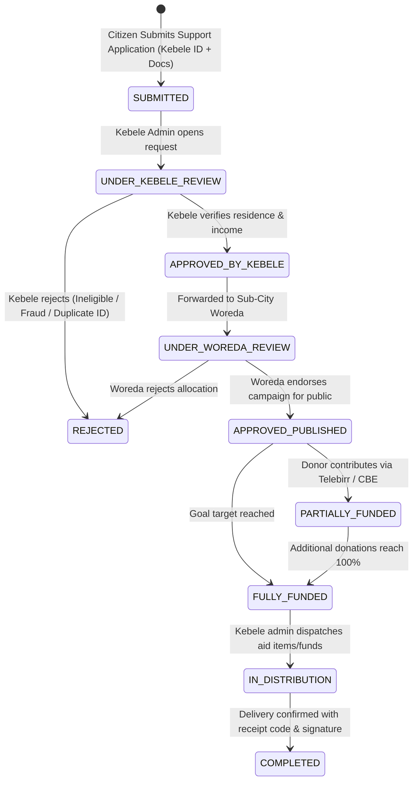

# Adama City Support Portal: Frontend Architecture & Backend Technical Specification

## 1. Executive Summary & System Overview

The **Adama City Support Portal** (Bulchiinsa Magaalaa Adaamaa / አዳማ ከተማ አስተዳደር) is a digitized municipal charity and welfare management system designed to replace paper-based relief requests with a transparent, 3-tier government verification pipeline (**Kebele → Woreda → Direct Delivery & Public Campaign**).

This document serves as the **authoritative blueprint for backend development**. It extracts 100% of the data structures, enum types, state transitions, authentication flows, business logic rules, and component requirements from the React/TypeScript frontend.

---

## 2. Role-Based Access Control (RBAC) Matrix

The system defines **6 distinct user roles** (`UserRole`), each with specialized permissions across data endpoints:

| Role Identifier | Role Description | Key Capabilities & Endpoint Permissions |
| :--- | :--- | :--- |
| `DONOR` | Individual, NGO, Corporate, or Diaspora Contributor | - Browse verified requests (`APPROVED_PUBLISHED`, `PARTIALLY_FUNDED`)<br>- Submit monetary or physical donations<br>- View personal donation history & download official digital receipts |
| `BENEFICIARY` | Resident Citizen seeking support | - Submit new support requests with Kebele ID & documentation<br>- Track request progress across verification stages<br>- View uploaded documents & status history |
| `KEBELE_ADMIN` | Local Kebele Administrator (e.g., Kebele 05 Bole) | - Inspect local submitted requests (`SUBMITTED`, `UNDER_KEBELE_REVIEW`)<br>- Perform household poverty assessment & duplicate National ID checks<br>- Approve (`APPROVED_BY_KEBELE`) or Reject (`REJECTED`) requests<br>- Record physical distribution & generate verification receipts |
| `WOREDA_ADMIN` | Sub-City Woreda Supervisor (e.g., Bole Sub-City Woreda) | - Audit Kebele-approved requests (`APPROVED_BY_KEBELE`)<br>- Endorse & publish campaigns (`APPROVED_PUBLISHED`) to the public catalog<br>- Monitor Kebele allocation balances across sub-city |
| `CITY_ADMIN` | Executive Mayor Cabinet Director | - Full city-wide dashboard & analytics oversight<br>- Access all city requests, donations, and distribution ledgers<br>- Export official city financial and impact reports (PDF/Excel) |
| `SYSTEM_ADMIN` | Technical IT & Security Administrator | - Provision government admin accounts (Kebele, Woreda, City Admin)<br>- Configure JWT expiry, MFA security policies, and IP whitelisting<br>- Monitor technical system health, database backups, and security audit logs |

---

## 3. Data Models & Database Schema Specification

Below are the exact database schema models required to persist the frontend state entities.

### 3.1 Enums & Constants

```sql
-- User Roles
CREATE TYPE user_role AS ENUM (
  'DONOR', 
  'BENEFICIARY', 
  'KEBELE_ADMIN', 
  'WOREDA_ADMIN', 
  'CITY_ADMIN', 
  'SYSTEM_ADMIN'
);

-- Support Categories
CREATE TYPE support_category AS ENUM (
  'FOOD_SUPPLIES',
  'MEDICAL_HEALTH',
  'EDUCATION_SCHOOLING',
  'HOUSING_SHELTER',
  'CLOTHING_ESSENTIALS',
  'DISABILITY_ASSISTANCE',
  'EMERGENCY_RELIEF',
  'SKILL_TRAINING'
);

-- Urgency Levels
CREATE TYPE urgency_level AS ENUM ('CRITICAL', 'HIGH', 'MEDIUM', 'LOW');

-- Request Lifecycle Statuses
CREATE TYPE request_status AS ENUM (
  'DRAFT',
  'SUBMITTED',
  'UNDER_KEBELE_REVIEW',
  'APPROVED_BY_KEBELE',
  'UNDER_WOREDA_REVIEW',
  'APPROVED_PUBLISHED',
  'PARTIALLY_FUNDED',
  'FULLY_FUNDED',
  'IN_DISTRIBUTION',
  'COMPLETED',
  'REJECTED'
);

-- Donation Types & Payment Methods
CREATE TYPE donation_type AS ENUM ('MONEY', 'PHYSICAL_ITEM', 'SERVICE');
CREATE TYPE payment_method AS ENUM ('TELEBIRR', 'CBE_BIRR', 'BANK_TRANSFER', 'CARD', 'PHYSICAL_HANDOVER');
CREATE TYPE donor_classification AS ENUM ('INDIVIDUAL', 'COMPANY', 'NGO', 'DIASPORA');
CREATE TYPE risk_level AS ENUM ('LOW', 'MEDIUM', 'HIGH');
```

---

### 3.2 Database Table Schemas

#### 1. `users` Table
```sql
CREATE TABLE users (
    id VARCHAR(64) PRIMARY KEY,
    full_name VARCHAR(128) NOT NULL,
    email VARCHAR(128) UNIQUE NOT NULL,
    phone VARCHAR(32) NOT NULL,
    password_hash VARCHAR(255),
    role user_role NOT NULL DEFAULT 'DONOR',
    avatar_url TEXT,
    city VARCHAR(64) DEFAULT 'Adama',
    woreda VARCHAR(128),
    kebele VARCHAR(128),
    national_id_number VARCHAR(64),
    org_name VARCHAR(128),
    org_reg_number VARCHAR(64),
    google_id VARCHAR(128) UNIQUE,
    google_connected BOOLEAN DEFAULT FALSE,
    is_verified BOOLEAN DEFAULT FALSE,
    status VARCHAR(32) DEFAULT 'ACTIVE', -- 'ACTIVE', 'PENDING_VERIFICATION', 'SUSPENDED'
    bio TEXT,
    address TEXT,
    tax_id VARCHAR(64),
    website VARCHAR(128),
    department VARCHAR(64),
    donor_type donor_classification DEFAULT 'INDIVIDUAL',
    household_size INT,
    language VARCHAR(8) DEFAULT 'en', -- 'en', 'om', 'am'
    email_notifications BOOLEAN DEFAULT TRUE,
    sms_notifications BOOLEAN DEFAULT TRUE,
    two_factor_enabled BOOLEAN DEFAULT FALSE,
    created_at TIMESTAMP WITH TIME ZONE DEFAULT CURRENT_TIMESTAMP,
    updated_at TIMESTAMP WITH TIME ZONE DEFAULT CURRENT_TIMESTAMP
);
```

#### 2. `beneficiary_requests` Table
```sql
CREATE TABLE beneficiary_requests (
    id VARCHAR(64) PRIMARY KEY,
    request_number VARCHAR(64) UNIQUE NOT NULL, -- Format: REQ-2026-XXXXX
    beneficiary_id VARCHAR(64) REFERENCES users(id),
    beneficiary_name VARCHAR(128) NOT NULL,
    beneficiary_phone VARCHAR(32) NOT NULL,
    national_id_number VARCHAR(64) NOT NULL,
    kebele VARCHAR(128) NOT NULL,
    woreda VARCHAR(128) NOT NULL,
    category support_category NOT NULL,
    urgency urgency_level NOT NULL DEFAULT 'MEDIUM',
    title VARCHAR(255) NOT NULL,
    description TEXT NOT NULL,
    household_size INT NOT NULL DEFAULT 1,
    estimated_amount_needed_etb NUMERIC(12,2) NOT NULL DEFAULT 0.00,
    amount_raised_etb NUMERIC(12,2) NOT NULL DEFAULT 0.00,
    item_quantity_needed TEXT,
    item_quantity_fulfilled TEXT,
    status request_status NOT NULL DEFAULT 'SUBMITTED',
    kebele_approved_by VARCHAR(128),
    kebele_approval_date DATE,
    woreda_approved_by VARCHAR(128),
    woreda_approval_date DATE,
    rejection_reason TEXT,
    created_at TIMESTAMP WITH TIME ZONE DEFAULT CURRENT_TIMESTAMP,
    updated_at TIMESTAMP WITH TIME ZONE DEFAULT CURRENT_TIMESTAMP
);
```

#### 3. `request_status_history` Table
```sql
CREATE TABLE request_status_history (
    id SERIAL PRIMARY KEY,
    request_id VARCHAR(64) REFERENCES beneficiary_requests(id) ON DELETE CASCADE,
    status request_status NOT NULL,
    updated_by VARCHAR(128) NOT NULL,
    comment TEXT,
    updated_at TIMESTAMP WITH TIME ZONE DEFAULT CURRENT_TIMESTAMP
);
```

#### 4. `request_documents` Table
```sql
CREATE TABLE request_documents (
    id VARCHAR(64) PRIMARY KEY,
    request_id VARCHAR(64) REFERENCES beneficiary_requests(id) ON DELETE CASCADE,
    name VARCHAR(255) NOT NULL,
    type VARCHAR(64) NOT NULL, -- 'KEBELE_ID', 'INCOME_LETTER', 'MEDICAL_DOC', 'PROOF_PHOTO'
    url TEXT NOT NULL,
    size_kb INT NOT NULL,
    uploaded_at TIMESTAMP WITH TIME ZONE DEFAULT CURRENT_TIMESTAMP
);
```

#### 5. `donations` Table
```sql
CREATE TABLE donations (
    id VARCHAR(64) PRIMARY KEY,
    donation_number VARCHAR(64) UNIQUE NOT NULL, -- Format: DON-2026-XXXX
    donor_id VARCHAR(64) REFERENCES users(id),
    donor_name VARCHAR(128) NOT NULL,
    donor_email VARCHAR(128) NOT NULL,
    donor_type donor_classification NOT NULL DEFAULT 'INDIVIDUAL',
    request_id VARCHAR(64) REFERENCES beneficiary_requests(id),
    target_category support_category,
    type donation_type NOT NULL DEFAULT 'MONEY',
    amount_etb NUMERIC(12,2),
    items_description TEXT,
    quantity NUMERIC(10,2),
    unit VARCHAR(32),
    payment_method payment_method,
    transaction_ref VARCHAR(128),
    status VARCHAR(32) NOT NULL DEFAULT 'PENDING', -- 'PENDING', 'CONFIRMED', 'ASSIGNED', 'DISTRIBUTED'
    assigned_to_request_id VARCHAR(64) REFERENCES beneficiary_requests(id),
    receipt_url TEXT,
    created_at TIMESTAMP WITH TIME ZONE DEFAULT CURRENT_TIMESTAMP
);
```

#### 6. `distribution_records` Table
```sql
CREATE TABLE distribution_records (
    id VARCHAR(64) PRIMARY KEY,
    distribution_number VARCHAR(64) UNIQUE NOT NULL, -- Format: DIST-2026-XXXX
    request_id VARCHAR(64) REFERENCES beneficiary_requests(id),
    beneficiary_name VARCHAR(128) NOT NULL,
    beneficiary_phone VARCHAR(32) NOT NULL,
    kebele VARCHAR(128) NOT NULL,
    woreda VARCHAR(128) NOT NULL,
    donation_id VARCHAR(64) REFERENCES donations(id),
    items_or_amount_distributed TEXT NOT NULL,
    distributed_by_kebele_admin VARCHAR(128) NOT NULL,
    confirmed_by_beneficiary BOOLEAN DEFAULT TRUE,
    delivery_photo_url TEXT,
    signature_mock TEXT,
    completed_at TIMESTAMP WITH TIME ZONE DEFAULT CURRENT_TIMESTAMP,
    receipt_verification_code VARCHAR(128) UNIQUE NOT NULL -- Format: ADM-K05-2026-XXXX
);
```

#### 7. `notifications` Table
```sql
CREATE TABLE notifications (
    id VARCHAR(64) PRIMARY KEY,
    user_id VARCHAR(64) REFERENCES users(id),
    title VARCHAR(255) NOT NULL,
    message TEXT NOT NULL,
    type VARCHAR(32) NOT NULL DEFAULT 'INFO', -- 'INFO', 'SUCCESS', 'WARNING', 'ALERT'
    read BOOLEAN DEFAULT FALSE,
    link VARCHAR(255),
    created_at TIMESTAMP WITH TIME ZONE DEFAULT CURRENT_TIMESTAMP
);
```

#### 8. `audit_logs` Table
```sql
CREATE TABLE audit_logs (
    id VARCHAR(64) PRIMARY KEY,
    user_id VARCHAR(64) NOT NULL,
    user_name VARCHAR(128) NOT NULL,
    role user_role NOT NULL,
    action VARCHAR(128) NOT NULL,
    module VARCHAR(128) NOT NULL,
    ip_address VARCHAR(45) NOT NULL,
    details TEXT NOT NULL,
    risk_level risk_level DEFAULT 'LOW',
    timestamp TIMESTAMP WITH TIME ZONE DEFAULT CURRENT_TIMESTAMP
);
```

---

## 4. End-to-End Business Workflows & State Lifecycle



### Key Business Logic Rules
1. **Duplicate Detection**:
   When a new request is submitted or reviewed, the backend must execute:
   `SELECT * FROM beneficiary_requests WHERE LOWER(national_id_number) = LOWER(:nationalId) AND status NOT IN ('REJECTED', 'COMPLETED')`.
2. **Auto-Funded Status Calculation**:
   When a donation is confirmed for `request_id`:
   `new_raised = amount_raised_etb + donation.amount_etb`.
   - If `new_raised >= estimated_amount_needed_etb`, set status to `FULLY_FUNDED`.
   - Else if `new_raised > 0` and current status is `APPROVED_PUBLISHED`, set status to `PARTIALLY_FUNDED`.
3. **Receipt Code Generation**:
   Upon creating a distribution record:
   `code = "ADM-K" + kebele_number + "-" + current_year + "-" + random_4_digits` (e.g. `ADM-K05-2026-8912`).

---

## 5. Complete RESTful API Endpoints Specification

### 5.1 Authentication (`/api/v1/auth`)

#### `POST /api/v1/auth/login`
- **Request Body**:
  ```json
  {
    "email": "donor@adama.gov.et",
    "password": "UserPassword123!"
  }
  ```
- **Response `200 OK`**:
  ```json
  {
    "token": "eyJhbGciOiJIUzI1Ni...",
    "user": {
      "id": "usr-donor-1",
      "fullName": "Abebe Bikila",
      "email": "donor@adama.gov.et",
      "role": "DONOR",
      "status": "ACTIVE"
    }
  }
  ```

#### `POST /api/v1/auth/google`
- **Request Body**:
  ```json
  {
    "idToken": "google-oauth-token-string",
    "email": "user@gmail.com",
    "fullName": "User Name",
    "avatarUrl": "https://...",
    "role": "DONOR"
  }
  ```

#### `POST /api/v1/auth/register`
- **Request Body**:
  ```json
  {
    "fullName": "Chaltu Dejene Gudeta",
    "email": "chaltu@gmail.com",
    "phone": "+251923334455",
    "role": "BENEFICIARY",
    "kebele": "Kebele 05 (Bole)",
    "woreda": "Bole Sub-City Woreda",
    "nationalIdNumber": "FIN-39820-ADA"
  }
  ```

#### `POST /api/v1/auth/forgot-password`
- **Request Body**:
  ```json
  { "emailOrPhone": "chaltu@gmail.com" }
  ```

---

### 5.2 Beneficiary Support Requests (`/api/v1/requests`)

#### `GET /api/v1/requests`
- **Query Parameters**:
  - `status`: `APPROVED_PUBLISHED`, `PARTIALLY_FUNDED`, `SUBMITTED`, etc.
  - `kebele`: Filter by Kebele name
  - `woreda`: Filter by Woreda name
  - `category`: `MEDICAL_HEALTH`, `FOOD_SUPPLIES`, etc.
  - `search`: Title, description, or beneficiary name search
- **Response `200 OK`**:
  ```json
  {
    "total": 5,
    "requests": [
      {
        "id": "req-101",
        "requestNumber": "REQ-2026-00101",
        "beneficiaryName": "Chaltu Dejene Gudeta",
        "nationalIdNumber": "FIN-39820-ADA",
        "kebele": "Kebele 05 (Bole)",
        "woreda": "Bole Sub-City Woreda",
        "category": "MEDICAL_HEALTH",
        "urgency": "CRITICAL",
        "title": "Urgent Specialized Dialysis Support",
        "estimatedAmountNeededEtb": 45000,
        "amountRaisedEtb": 32000,
        "status": "APPROVED_PUBLISHED",
        "documents": [],
        "createdAt": "2026-03-01T09:00:00Z"
      }
    ]
  }
  ```

#### `POST /api/v1/requests`
- **Request Body**:
  ```json
  {
    "beneficiaryId": "usr-ben-1",
    "beneficiaryName": "Chaltu Dejene",
    "beneficiaryPhone": "+251923334455",
    "nationalIdNumber": "FIN-39820-ADA",
    "kebele": "Kebele 05 (Bole)",
    "woreda": "Bole Sub-City Woreda",
    "category": "MEDICAL_HEALTH",
    "urgency": "CRITICAL",
    "title": "Urgent Specialized Dialysis",
    "description": "Details...",
    "householdSize": 4,
    "estimatedAmountNeededEtb": 45000,
    "documents": [
      {
        "name": "Kebele_05_Resident_ID.pdf",
        "type": "KEBELE_ID",
        "url": "https://s3.amazonaws.com/...",
        "sizeKb": 420
      }
    ]
  }
  ```

#### `PATCH /api/v1/requests/:id/status`
- **Request Body**:
  ```json
  {
    "status": "APPROVED_BY_KEBELE",
    "comment": "Household visit verified low-income status certificate #4820."
  }
  ```

#### `GET /api/v1/requests/check-duplicate`
- **Query Parameter**: `nationalId=FIN-39820-ADA`
- **Response `200 OK`**:
  ```json
  {
    "isDuplicate": true,
    "existingRequests": [
      { "id": "req-101", "requestNumber": "REQ-2026-00101", "status": "APPROVED_PUBLISHED" }
    ]
  }
  ```

---

### 5.3 Donations & Payment Integration (`/api/v1/donations`)

#### `POST /api/v1/donations`
- **Request Body**:
  ```json
  {
    "donorId": "usr-donor-1",
    "donorName": "Abebe Bikila",
    "donorEmail": "donor@adama.gov.et",
    "donorType": "INDIVIDUAL",
    "requestId": "req-101",
    "targetCategory": "MEDICAL_HEALTH",
    "type": "MONEY",
    "amountEtb": 15000,
    "paymentMethod": "TELEBIRR",
    "transactionRef": "TLB-8930219482"
  }
  ```

#### `POST /api/v1/donations/verify-payment` (Telebirr & CBE Birr Webhook)
- **Request Body**:
  ```json
  {
    "transactionRef": "TLB-8930219482",
    "paymentProvider": "TELEBIRR",
    "amount": 15000,
    "status": "SUCCESS"
  }
  ```

---

### 5.4 Distribution & Verification (`/api/v1/distributions`)

#### `POST /api/v1/distributions`
- **Request Body**:
  ```json
  {
    "requestId": "req-105",
    "beneficiaryName": "Fatuma Mohammed",
    "beneficiaryPhone": "+251926669988",
    "kebele": "Kebele 11 (Wonji Road)",
    "woreda": "Wonji-Geda Rural Woreda",
    "donationId": "don-502",
    "itemsOrAmountDistributed": "18 Corrugated Iron Sheets",
    "distributedByKebeleAdmin": "Bekele Desta (Kebele 11)",
    "signatureMock": "Fatuma M. (Fingerprint Verified)"
  }
  ```

#### `GET /api/v1/distributions/verify/:receiptVerificationCode`
- **Public Endpoint** (No Auth Required)
- **Response `200 OK`**:
  ```json
  {
    "isValid": true,
    "record": {
      "distributionNumber": "DIST-2026-0901",
      "receiptVerificationCode": "ADM-K11-2026-9910",
      "beneficiaryName": "Fatuma Mohammed",
      "kebele": "Kebele 11 (Wonji Road)",
      "itemsOrAmountDistributed": "18 Corrugated Iron Sheets",
      "completedAt": "2026-02-22T15:00:00Z"
    }
  }
  ```

---

### 5.5 Administration & Security Audit (`/api/v1/admin`)

#### `POST /api/v1/admin/provision`
- **Required Role**: `SYSTEM_ADMIN`
- **Request Body**:
  ```json
  {
    "fullName": "Kibreab Lemma",
    "email": "kebele05@adama.gov.et",
    "phone": "+251912223344",
    "role": "KEBELE_ADMIN",
    "kebele": "Kebele 05 (Bole)",
    "woreda": "Bole Sub-City Woreda"
  }
  ```

#### `GET /api/v1/audit-logs`
- **Required Roles**: `SYSTEM_ADMIN`, `CITY_ADMIN`
- **Response `200 OK`**:
  ```json
  {
    "logs": [
      {
        "id": "log-801",
        "userName": "Dr. Aster Negash",
        "role": "WOREDA_ADMIN",
        "action": "APPROVE_BENEFICIARY_REQUEST",
        "module": "Beneficiary Management",
        "ipAddress": "197.156.98.12",
        "timestamp": "2026-03-04T08:30:00Z",
        "riskLevel": "LOW"
      }
    ]
  }
  ```

---

## 6. Storage & File Upload Specification

The frontend supports uploading key identity and medical documents for each beneficiary request:
- **`KEBELE_ID`**: Resident National/Kebele Identity Card
- **`INCOME_LETTER`**: Official Poverty / Low-Income Status Verification Letter from Kebele
- **`MEDICAL_DOC`**: Hospital Diagnosis / Prescription / Treatment Invoice
- **`PROOF_PHOTO`**: Household damage or delivery confirmation photo

### Recommended Backend Storage Architecture
- Store file objects in **AWS S3 / Google Cloud Storage / MinIO**.
- Endpoint: `POST /api/v1/upload` (Multipart form payload).
- Returns: `{ "url": "https://storage.adama.gov.et/documents/doc-123.pdf", "sizeKb": 420 }`.

---

## 7. Public Reference Metadata

### 15 Official Adama Kebeles (`ADAMA_KEBELES`)
1. `Kebele 01 (Posta Biet)`
2. `Kebele 02 (Awash)`
3. `Kebele 03 (St. George)`
4. `Kebele 04 (Leku)`
5. `Kebele 05 (Bole)`
6. `Kebele 06 (Lugaba)`
7. `Kebele 07 (Melka Adama)`
8. `Kebele 08 (Demdela)`
9. `Kebele 09 (Goro)`
10. `Kebele 10 (Migira)`
11. `Kebele 11 (Wonji Road)`
12. `Kebele 12 (Expressway Zone)`
13. `Kebele 13 (Apostolic Area)`
14. `Kebele 14 (Dera Gate)`
15. `Kebele 15`

### Adama Sub-City Woredas (`ADAMA_WOREDAS`)
1. `Bole Sub-City Woreda`
2. `Lugaba Sub-City Woreda`
3. `Central Adama Woreda`
4. `Wonji-Geda Rural Woreda`

---

## 8. Summary Checklist for Backend Developers

- [ ] Initialize Node.js/Express, Go, or Python FastAPI backend framework.
- [ ] Create Database Migration Scripts corresponding to Section 3 SQL schemas.
- [ ] Implement JWT Auth & Middleware for `UserRole` authorization.
- [ ] Set up Payment Gateway Webhook handlers for **Telebirr** and **CBE Birr**.
- [ ] Implement National ID Duplicate Search logic (`/api/v1/requests/check-duplicate`).
- [ ] Enable Public Verification Endpoint for Digital Receipt Codes (`/api/v1/distributions/verify/:code`).
- [ ] Implement Automatic Audit Logging Middleware for status updates, provisioning, and donations.
